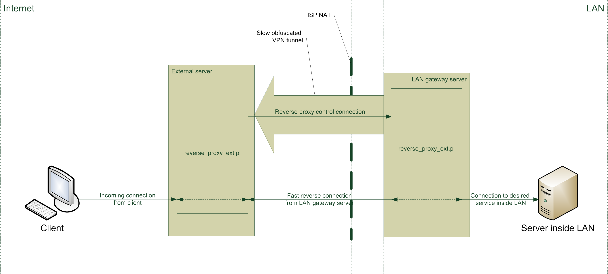

# Reverse proxy
## What is this?
This scripts allows you to serve external clients with high speed, having external server, slow VPN and fast masqueraded connection to Internet from LAN.
And there is some questions:

* Why VPN can be slower than direct connection? First of all - in need of obfuscation. To withstand DPI, you should mask your VPN traffic mimicking to innocent web requests. This dramatically reduces speed of bulk transfer.
* Why use masqueraded connection? Because it's cheap.
* Why it needs VPN connection at all? Currently, control connection is not protected in any way, so some isolation from Internet and LAN is required. May be, in future, this scripts will have authentication and encryption in control connection, so it will be possible to avoid use of VPN.

## How things work
First of all, let's see to this diagram:

There are three servers: external server, LAN gateway server, and some server inside LAN. LAN gateway doesn't have real IP address and access Internet through ISP NAT. There is VPN established between LAN gateway server and external server. It is slow for bulk transfers because, for example, of obfuscation. However, direct connection, made from LAN gateway server to somewhere in Internet is fast. We want to allow clients from Internet to access some TCP service with bulk transfers, running on server inside of our LAN. 

So, there is two scripts: reverse\_proxy\_ext.pl and reverse\_proxy\_int.pl. First (external part) runs on external server, last (internal part) runs on internal gateway server. After start, internal part waits for control connection on VPN interface. At start of external part, it establishes control connection through VPN to internal part, and waits for incoming connections from Internet according to it's "phonebook". "Phonebook" of external part consists of port number (where it listens to connection from clients from Internet), and service name pairs.
When some client connects to external part, it opens another listening socket, called reverse. After that it sends request with reverse socket port number and service name to internal part through control connection. Internal part, having received this request, connects to some service inside LAN according to it's own "phonebook". "Phonebook" of internal part consists of service name and [ip address and port] pairs. Successfully connected inside of LAN, internal part opens reverse connection to external part. Successfully connected, both internal and external part just forward data through reverse connection in both directions. For each client connection from Internet, there is dedicated reverse connection between external and internal parts. But there is only one control connection.

